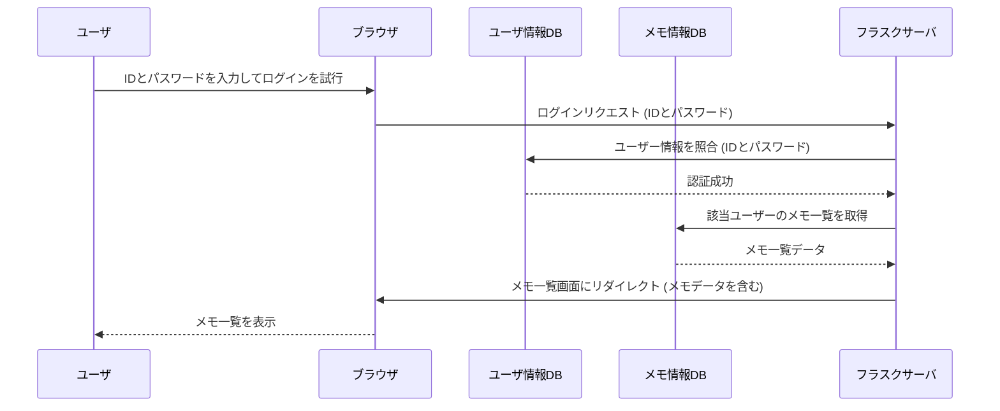

```mermaid
sequenceDiagram
    participant user as ユーザ
    participant browser as ブラウザ
    participant udb as ユーザ情報DB
    participant mdb as メモ情報DB
    participant flask as フラスクサーバ

    user ->> browser: IDとパスワードを入力してログインを試行
    browser ->> flask: ログインリクエスト (IDとパスワード)
    flask ->> udb: ユーザー情報を照合 (IDとパスワード)
    udb -->> flask: 認証成功
    flask ->> mdb: 該当ユーザーのメモ一覧を取得
    mdb -->> flask: メモ一覧データ
    flask ->> browser: メモ一覧画面にリダイレクト (メモデータを含む)
    browser -->> user: メモ一覧を表示
```