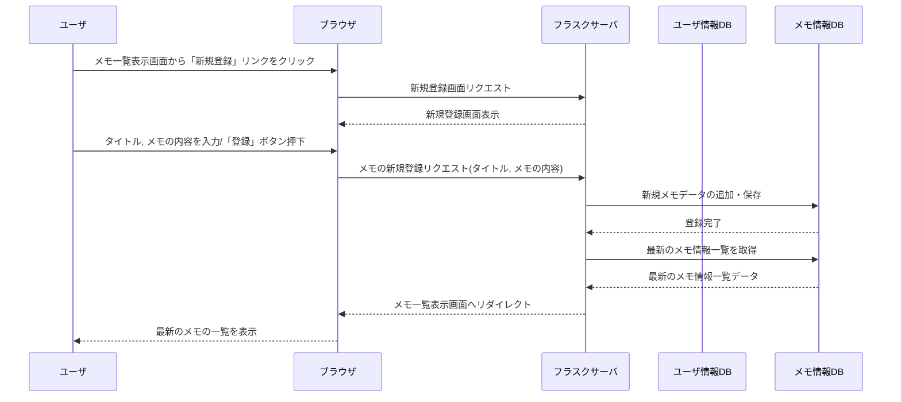

```mermaid
sequenceDiagram
    participant user as ユーザ
    participant browser as ブラウザ
    participant flask as フラスクサーバ
    participant udb as ユーザ情報DB
    participant mdb as メモ情報DB

    user ->> browser: メモ一覧表示画面から「新規登録」リンクをクリック
    browser ->> flask: 新規登録画面リクエスト
    flask -->> browser: 新規登録画面表示

    user ->> browser: タイトル, メモの内容を入力/「登録」ボタン押下
    browser ->> flask: メモの新規登録リクエスト(タイトル, メモの内容)
    flask ->> mdb: 新規メモデータの追加・保存
    mdb -->> flask: 登録完了

    flask ->> mdb: 最新のメモ情報一覧を取得
    mdb -->> flask: 最新のメモ情報一覧データ
    flask -->> browser: メモ一覧表示画面へリダイレクト
    browser -->> user: 最新のメモの一覧を表示

```