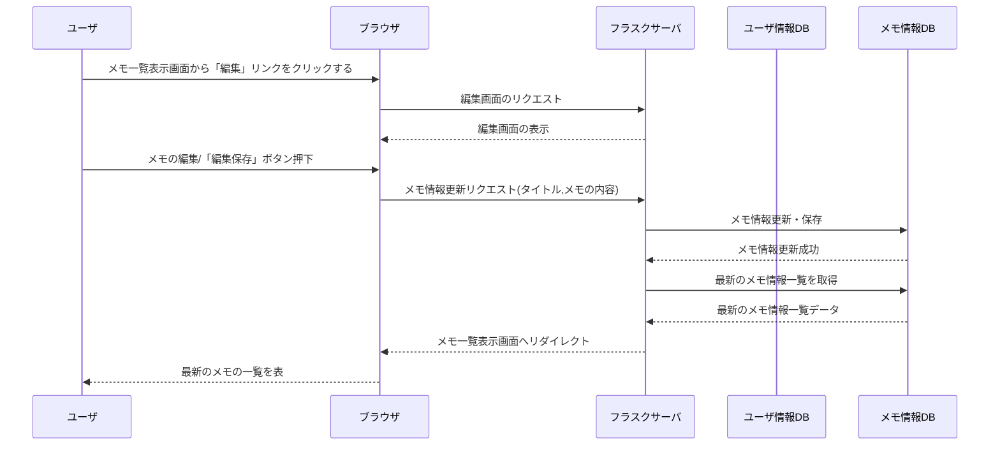

```mermaid
sequenceDiagram
    participant user as ユーザ
    participant browser as ブラウザ
    participant flask as フラスクサーバ
    participant udb as ユーザ情報DB
    participant mdb as メモ情報DB

    user ->> browser: メモ一覧表示画面から「編集」リンクをクリックする
    browser ->> flask: 編集画面のリクエスト
    flask -->> browser: 編集画面の表示

    user ->> browser: メモの編集/「編集保存」ボタン押下
    browser ->> flask: メモ情報更新リクエスト(タイトル,メモの内容)
    flask ->> mdb: メモ情報更新・保存
    mdb -->> flask: メモ情報更新成功

    flask ->> mdb: 最新のメモ情報一覧を取得
    mdb -->> flask: 最新のメモ情報一覧データ
    flask -->> browser: メモ一覧表示画面へリダイレクト
    browser -->> user: 最新のメモの一覧を表

```