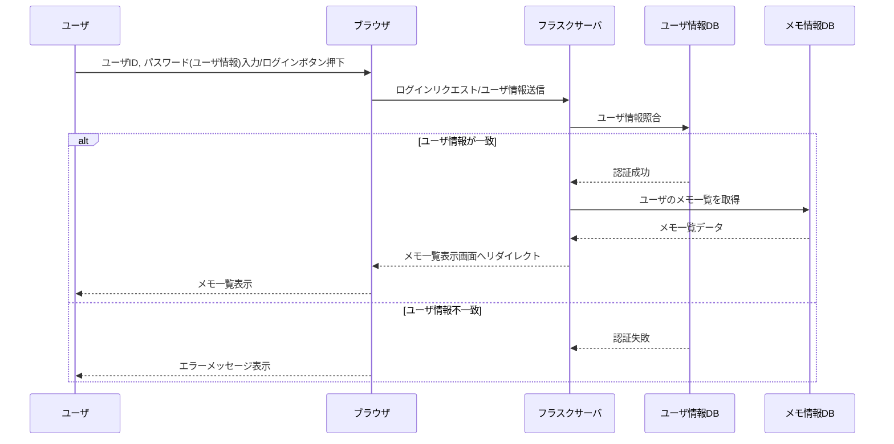

```mermaid
sequenceDiagram
    participant user as ユーザ
    participant browser as ブラウザ
    participant flask as フラスクサーバ
    participant udb as ユーザ情報DB
    participant mdb as メモ情報DB

    user ->> browser: ユーザID, パスワード(ユーザ情報)入力/ログインボタン押下
    browser ->> flask: ログインリクエスト/ユーザ情報送信
    flask ->> udb: ユーザ情報照合

    alt ユーザ情報が一致
        udb -->> flask: 認証成功
        flask ->> mdb: ユーザのメモ一覧を取得
        mdb -->> flask: メモ一覧データ
        flask -->> browser: メモ一覧表示画面へリダイレクト
        browser -->> user: メモ一覧表示
    else ユーザ情報不一致
        udb -->> flask: 認証失敗
        browser -->> user: エラーメッセージ表示
    end

```