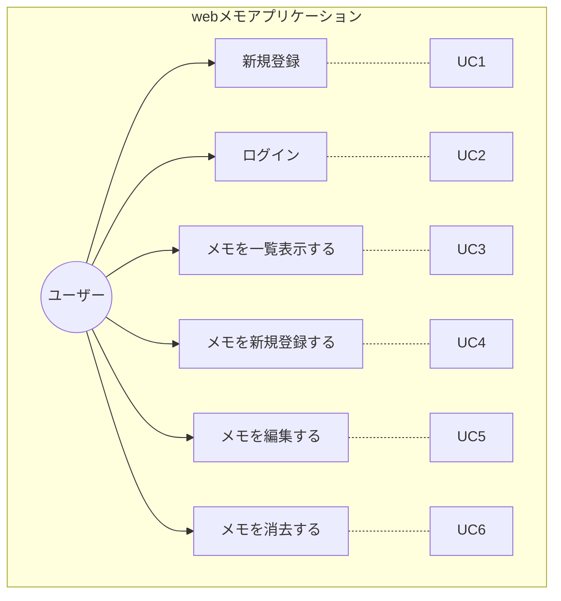

```mermaid
flowchart TB
    subgraph "webメモアプリケーション"
        User((ユーザー))
        AddUser[新規登録]
        Login[ログイン]
        ShowData[メモを一覧表示する]
        AddData[メモを新規登録する]
        EditData[メモを編集する]
        DeleteData[メモを消去する]
    

        User --> AddUser -.- UC1
        User --> Login -.- UC2 
        User --> ShowData -.- UC3
        User --> AddData -.- UC4
        User --> EditData -.- UC5
        User --> DeleteData -.- UC6
    end
```