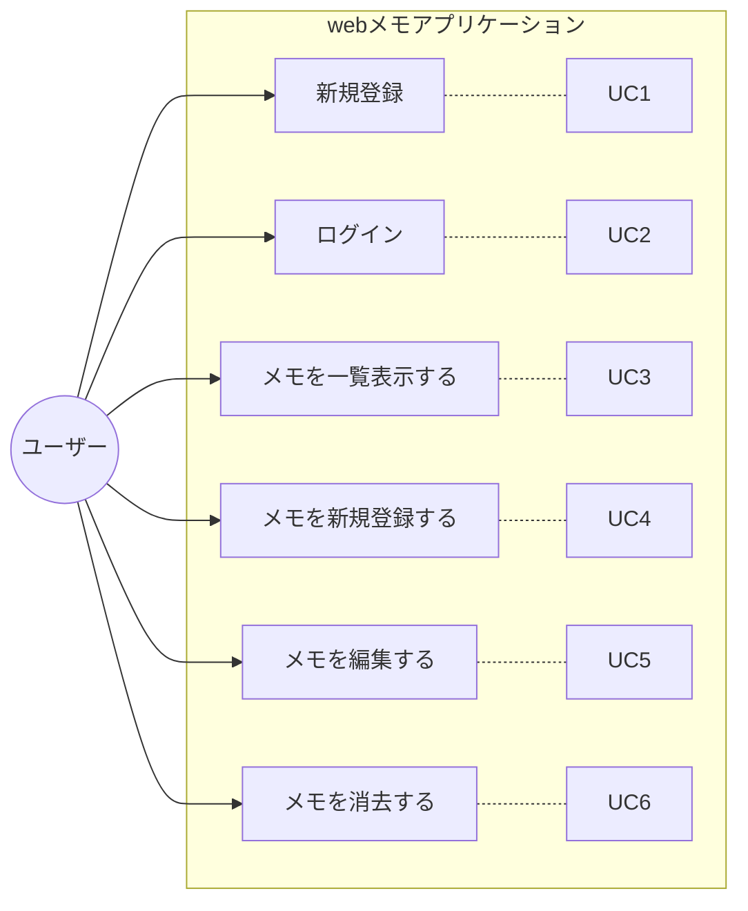

```mermaid
flowchart LR

    User((ユーザー))

    subgraph "webメモアプリケーション"
    
        AddUser[新規登録]
        Login[ログイン]
        ShowData[メモを一覧表示する]
        AddData[メモを新規登録する]
        EditData[メモを編集する]
        DeleteData[メモを消去する]

        AddUser -.- UC1
        Login -.- UC2 
        ShowData -.- UC3
        AddData -.- UC4
        EditData -.- UC5
        DeleteData -.- UC6

    end

    User --> AddUser
    User --> Login
    User --> ShowData
    User --> AddData
    User --> EditData
    User --> DeleteData
```